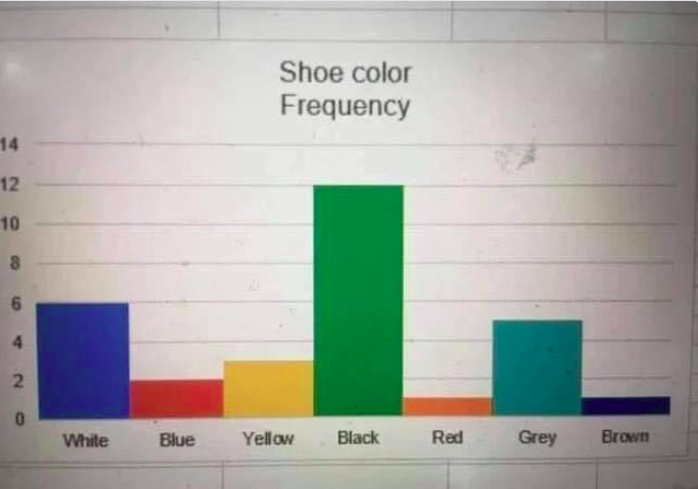
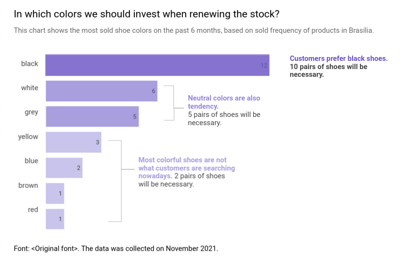

# Data Visualization

In this section, I'm going to analyze and improve some visualizations founded in WTF Visualizations website (https://viz.wtf/) based on principles of the book "Storytelling with Data".

## Bar chart

I'm going to use a visualization to show the shoe colors that are more popular in some period of time, and get to the conclusion of what shoe color the CEO should buy in higher quantities.

**Audience:** CEO of a shoe store.
**Objective:** Show the quantity of shoes of each color the CEO should buy for the store.

Original visualization: https://viz.wtf/post/639589038118125568.

    

    
Improved visualization: https://datastudio.google.com/reporting/f4dc6ebc-d65f-4d56-809b-200cc7ce0e61

    

