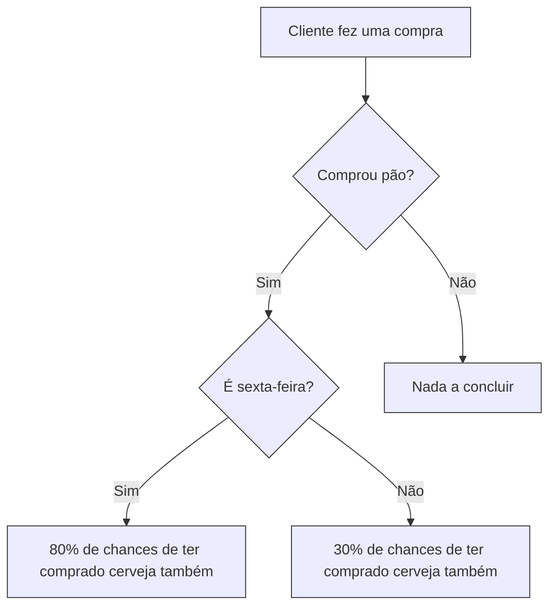
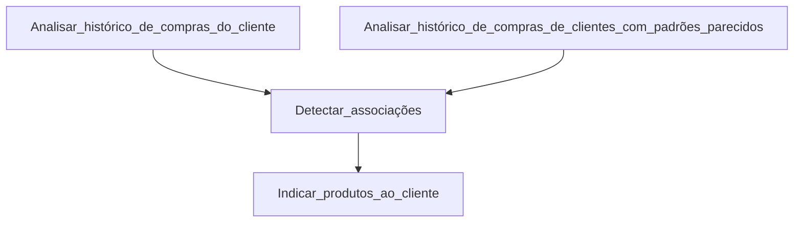

# Regras de Associação

## O que é?
A criação de regras de associação consiste na busca por padrões frequentes, associações, padrões temporais, correlações. Elas geralmente seguem uma lógica de consequência condicional: 

:large_blue_diamond:    Se aconteceu _isso_, a chance _disso_ acontecer é de _x$._

## Quando utilizar?
Geralmente utilizado em aprendizados não supervisionados aplicados a atributos categóricos.

Essas associações podem ser entre variáveis de diferentes tipos:
- Booleanas
- Quantitativas
- Unidimensionais
- Multidimensionais

### Exemplo
Por exemplo, um cliente fez uma compra online e queremos entender o padrão de consumo dele para indicarmos outros produtos para a próxima compra, então devemos analisar o que ele comprou de acordo com o histórico de pedidos e entender os produtos que costumam ser comprados juntos por ele ou por consumidores que fazem compras parecidas para descobrirmos produtos associados e indicá-los ao cliente. Neste caso, a análise pode ficar ainda mais rica se considerarmos as marcas e características dos produtos. Vale ressaltar também a importância de entendermos o motivo de alguns produtos serem comprados juntos e também a época/dia/horário, isso pode ser uma evidência de um costume rotineiro dos consumidores.

:triangular_flag_on_post: **Atenção:** Associação não implica correlação ou causalidade, é necessário investigar os dados mais a fundo para chegar a tais conclusões.

## Métricas de avaliação

### Suporte
### Confiança
<!-- <kbd>ALT + F4</kbd>
Texto <mark>marcado</mark>

 
Item centralizado

Clique aqui para exibir

texto oculto

  ---
***
___
 -->
